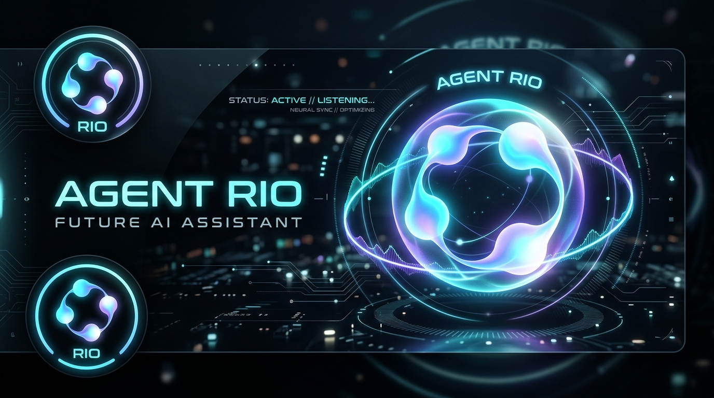

<div align="center">



# ⚡ Agent Rio (এজেন্ট রিও)
### *Autonomous Voice-Activated Android AI Automation Agent with "GPT Dots" Fluid UI*

[](https://github.com/Manik51/Agent-Rio/actions/workflows/build-apk.yml)
[](https://flutter.dev)
[%20--%2015%20(API%2035)-3DDC84?logo=android&logoColor=white)](https://developer.android.com)
[](https://aistudio.google.com)
[](https://developer.amazon.com)
[](LICENSE)

<p align="center">
  <b>Agent Rio</b> is a next-generation on-device autonomous assistant for Android. Featuring a floating <b>"GPT Dots"</b> fluid animated avatar, dual-trigger activation (Tap-to-Talk + "Hey Rio" wake-word), multi-provider AI reasoning (Gemini, OpenRouter, DeepSeek), offline hardware macros, and an automated WhatsApp Voice Calling engine.
</p>

[**Download Latest APK**](https://github.com/Manik51/Agent-Rio/actions) • [**Setup Guide**](#-quick-start-guide) • [**Features**](#-core-features) • [**Architecture**](#-system-architecture)

</div>

---

## 🌟 Core Features

### 1. 🔮 Fluid "GPT Dots" Floating Avatar
* **System-Wide Overlay:** A persistent, draggable floating bubble that snaps smoothly to screen edges.
* **4-State Morphing Physics:**
  * ⚪ **Idle:** Calm circular orbit with 4 multi-tonal luminous dots undulating in an organic breathing rhythm.
  * 🔵 **Listening:** Dots stretch and elasticize dynamically into acoustic frequency waves in response to speech.
  * 🟡 **Thinking / Working:** Rapid orbital vortex swirl with glowing particle trails while parsing screen layouts or reasoning.
  * 🟢 **Speaking / Success:** Harmonic speech cadence bloom confirming actions or reading responses.

### 2. 🎙️ Dual Trigger Activation
* **Tap-to-Talk:** Tap the floating avatar anywhere on your screen to immediately start voice recognition.
* **Hands-Free Wake Word:** Integrated offline wake-word detector listens for **"Hey Rio"** hands-free.

### 3. 🧠 Hybrid Brain (Multi-Provider AI + Offline Fast Macros)
* **Google Gemini Direct Support:** Plug-and-play compatibility with Google's state-of-the-art `gemini-2.0-flash` endpoint.
* **OpenRouter Universal Hub:** Access Claude 3.5 Sonnet, DeepSeek R1, Llama 3.3, and free community models in 1 tap.
* **DeepSeek V3 / R1 Native:** High-speed, economical reasoning for autonomous screen navigation.
* **Offline Hardware Macros:** Even with **NO internet connection**, Rio instantly toggles Wi-Fi, Bluetooth, volume, flashlight, launches apps, or locks the device without latency.
* **Smart "Good Night" Sequence:** Say *"Turn off WiFi and Bluetooth, good night"*; Rio confirms aloud first via voice, toggles both radios off via Quick Settings, lowers media volume, and puts the phone to sleep.

### 4. 🗣️ Hybrid Voice Engine (Alexa TTS + Offline Fallback)
* **Online Natural Voice:** Synthesizes speech using Alexa's signature neural cadence.
* **Zero-Failure Offline Fallback:** Gracefully falls back to Android's built-in offline Text-to-Speech engine if the network drops.
* **Speech-First Confirmation:** Rio speaks its planned actions aloud to the user *before* executing UI taps.

### 5. 📞 The "Free AI Calling" Hack (WhatsApp Voice Note Engine)
* Generates high-fidelity neural voice notes on the fly.
* Dispatches audio directly to targeted WhatsApp contacts via Android Intents.
* Automatically confirms and sends using the Accessibility layer.
* Monitors chat responses in real-time and reads incoming replies back to you aloud!

### 6. 🚀 Automated Cloud CI/CD
* Every commit pushed to `main` automatically triggers **GitHub Actions**.
* Compiles **Universal Release APKs** and split-ABI builds (`arm64-v8a`) in the cloud—no local Android Studio or Flutter SDK installation required!

---

## 🏗️ System Architecture

```
                               ┌────────────────────────────────────────┐
                               │         AGENT RIO RUNTIME CORE         │
                               └───────────────────┬────────────────────┘
                                                   │
                   ┌───────────────────────────────┼───────────────────────────────┐
                   ▼                               ▼                               ▼
       ┌───────────────────────┐       ┌───────────────────────┐       ┌───────────────────────┐
       │     TRIGGER LAYER     │       │    COGNITIVE BRAIN    │       │     OUTPUT LAYER      │
       ├───────────────────────┤       ├───────────────────────┤       ├───────────────────────┤
       │ • "GPT Dots" Tap-Talk │       │ • Fast Local Macros   │       │ • Alexa Neural TTS    │
       │ • "Hey Rio" Wake-Word │ ────► │ • Google Gemini 2.0   │ ────► │ • Android Offline TTS │
       │ • Android STT Engine  │       │ • OpenRouter Hub      │       │ • "GPT Dots" Fluid UI │
       └───────────────────────┘       │ • DeepSeek V3 / R1    │       └───────────────────────┘
                                       └───────────┬───────────┘
                                                   │
                                                   ▼
                                       ┌───────────────────────┐
                                       │    EXECUTION LAYER    │
                                       ├───────────────────────┤
                                       │ • Accessibility Tree  │
                                       │ • Quick Settings API  │
                                       │ • WhatsApp Automation │
                                       │ • Shizuku ADB Shell   │
                                       └───────────────────────┘
```

---

## ⚡ Quick Start Guide

### Step 1: Download the APK
1. Go to the [**Actions Tab**](https://github.com/Manik51/Agent-Rio/actions) of this repository.
2. Select the latest successful workflow run.
3. Scroll down to **Artifacts** and download **`AgentRio-APKs`**.
4. Unzip and install `AgentRio-Universal-Release.apk` (or `AgentRio-arm64-v8a-Release.apk` for modern devices).

### Step 2: Grant Core Android Permissions
When opening Agent Rio for the first time, enable:
1. **Display Over Other Apps (Overlay):** Enables the floating "GPT Dots" avatar.
2. **Accessibility Service:** Go to *Settings → Accessibility → Agent Rio Screen Control* and turn it **ON**.
   > *Note for Android 13+: If Android shows "Restricted setting", go to App Info for Agent Rio, tap the 3 dots in the top right, tap "Allow restricted settings", then enable Accessibility.*
3. **Ignore Battery Optimizations:** Prevents OEM schedulers (MIUI, OneUI, ColorOS) from sleeping Rio's background listener.

### Step 3: Choose Your AI Provider in Settings
Tap the **Settings** icon in Agent Rio:
* **Option A: Google Gemini (Recommended & Fast)**
  * Tap the **Gemini** preset chip.
  * Enter your Gemini API key from [Google AI Studio](https://aistudio.google.com).
  * Uses `gemini-2.0-flash` out-of-the-box.
* **Option B: OpenRouter (Universal)**
  * Tap the **OpenRouter** preset chip.
  * Enter your OpenRouter key (`sk-or-v1-...`).
  * Access models like `google/gemini-2.0-flash-001`, `deepseek/deepseek-r1`, or `anthropic/claude-3.5-sonnet`.
* **Option C: DeepSeek**
  * Tap the **DeepSeek** preset chip.
  * Enter your DeepSeek key (`sk-...`).

---

## 💬 Voice & Command Examples

| Voice Command | Action Executed |
| :--- | :--- |
| **"Turn off WiFi and Bluetooth, good night"** | Speaks confirmation, pulls down Quick Settings, turns off Wi-Fi & Bluetooth, lowers volume, locks screen. |
| **"Turn on / off Wi-Fi"** | Opens Wi-Fi toggle immediately without network roundtrip. |
| **"Open YouTube and search for lofi beats"** | Launches YouTube, reads screen tree, taps search bar, types query, and presses Enter. |
| **"Call Mom on WhatsApp saying I'll be home late"** | Synthesizes Alexa audio note, opens Mom's chat in WhatsApp, attaches note, presses Send, and reads her reply back to you. |
| **"Mute volume"** | Sets media volume to 0%. |
| **"What is quantum computing?"** | Speaks comprehensive natural explanation via online Gemini/DeepSeek brain. |

---

## 🛠️ Tech Stack & Dependencies

* **Framework:** [Flutter](https://flutter.dev) (Dart 3+)
* **Overlay Engine:** `flutter_overlay_window` (Hardware-accelerated native window)
* **Graphics & Animation:** Flutter `CustomPainter` with fluid metaball wave physics
* **Speech & Audio:**
  * `speech_to_text` (Real-time acoustic ingestion)
  * `flutter_tts` (Offline system speech fallback)
  * Android Native `MediaPlayer` (Low-latency audio streaming)
* **Screen Automation:** Android `AccessibilityService` (Hierarchical UI tree inspection, coordinate gesture dispatch, screenshot capture)

---

## 🤝 Contributing & License

Contributions, bug reports, and feature requests are welcome! Feel free to open an issue or submit a pull request.

This project is licensed under the **MIT License**.

### Acknowledgments
* Architectural foundation inspired by and forked from [`orailnoor/private-agent`](https://github.com/orailnoor/private-agent).
* Re-engineered and enhanced into **Agent Rio** by [Manik Shil](https://github.com/Manik51).
