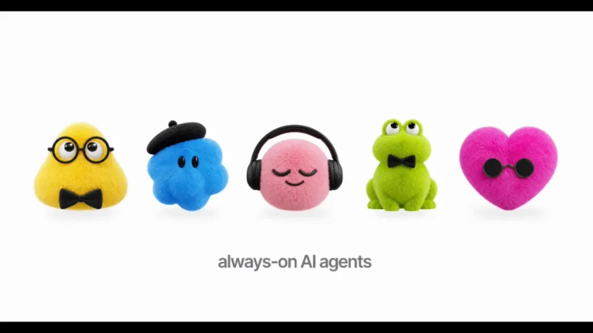

# Agent Rio
**Always-on, voice-activated autonomous AI companion for Android**

  <a href="#-quick-start"><b>Download APK</b></a> •
  <a href="#-features"><b>Features</b></a> •
  <a href="#-choose-your-companion"><b>Companion Avatars</b></a> •
  <a href="#-configuration"><b>AI Setup</b></a>

---

## ✨ Features

* **🎭 Customizable Companion Avatars:** Choose your favorite floating character (Pinky Chill, Professor Pip, Blue Beret, Froggy, Hearty, or GPT Dots).
* **🎙️ Dual Trigger:** Tap the floating avatar anytime or use offline hands-free wake word (*"Hey Rio"*).
* **🧠 Multi-Brain AI Support:** Seamless 1-tap presets for **Google Gemini 2.0 Flash**, **OpenRouter** (Claude, Llama, DeepSeek R1), and **DeepSeek**.
* **⚡ Offline Fast Macros:** Toggle Wi-Fi, Bluetooth, volume, or trigger bedtime sequences (*"Turn off WiFi and Bluetooth, good night"*) with zero network latency.
* **🗣️ Hybrid Voice Engine:** Premium Alexa-style neural speech online with automatic fallback to offline Android TTS.
* **📞 WhatsApp Voice Note Engine:** Locally generates voice notes, attaches them to contacts, auto-sends, and reads incoming replies aloud.
* **🚀 Instant Cloud CI/CD:** GitHub Actions automatically builds release APKs on every push to `main`—no local Android build environment needed.

---

## 🧸 Choose Your Companion

Agent Rio lets you customize your floating assistant with animated expressive avatars:

| Avatar | Character | Personality |
| :--- | :--- | :--- |
| 🎧 **Pinky Chill** | Pink fuzzy with headphones | Music, casual conversations, and voice playback |
| 🤓 **Professor Pip** | Yellow triangle with glasses & bow tie | Smart automation, deep search, and productivity |
| 🎨 **Blue Beret** | Blue fuzzy cloud with beret | Creative writing, ideas, and screen interpretation |
| 🐸 **Froggy** | Curious green explorer | Quick system toggles, macros, and diagnostics |
| 💖 **Hearty** | Fuzzy magenta heart with sunglasses | Friendly messaging, WhatsApp dispatch, and reminders |
| ⚪ **GPT Dots** | Minimal fluid morphing particles | Sleek, modern acoustic wave aesthetic |

---

## ⚡ Quick Start

### 1. Download & Install
1. Open the [**GitHub Actions Tab**](https://github.com/Manik51/Agent-Rio/actions).
2. Click the latest green workflow run.
3. Download the **`AgentRio-APKs`** zip from Artifacts.
4. Install `AgentRio-Universal-Release.apk` on your Android phone.

### 2. Grant Permissions
* **Display Over Other Apps:** Enables your persistent floating companion.
* **Accessibility Service:** Enable *Agent Rio Screen Control* to automate taps and parse screens.
* **Ignore Battery Optimizations:** Keeps Rio listening in the background.

---

## ⚙️ Configuration

Open **Settings** inside Agent Rio to choose your AI backend:

* **Google Gemini (Fast & Free Tier):**
  * Tap **Gemini** → Enter your API key from [Google AI Studio](https://aistudio.google.com).
* **OpenRouter (Any Model):**
  * Tap **OpenRouter** → Enter your `sk-or-v1-...` key to access Claude 3.5, Gemini Flash, or DeepSeek R1.
* **DeepSeek:**
  * Tap **DeepSeek** → Enter your DeepSeek API key.

---

## 📄 License & Credits

* Licensed under the **MIT License**.
* Core Android accessibility framework based on [`orailnoor/private-agent`](https://github.com/orailnoor/private-agent).
* Re-architected and maintained by [Manik Shil](https://github.com/Manik51).
